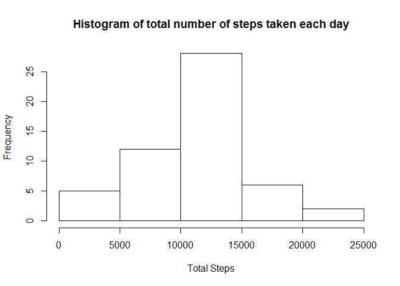
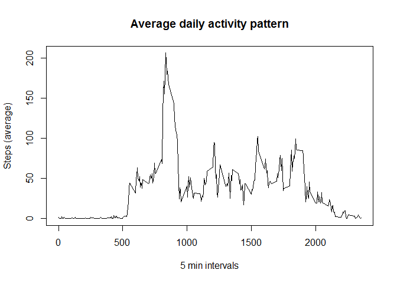
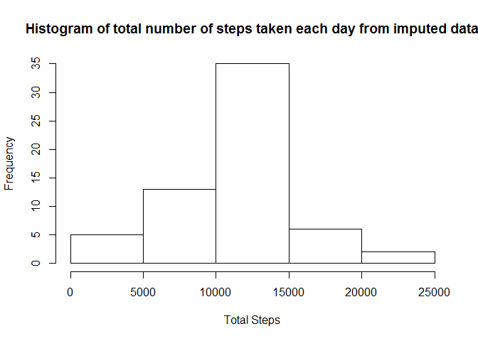
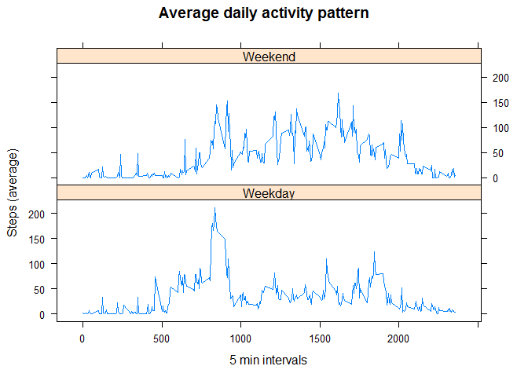

# Reproducible Research: Peer Assessment 1


## Loading and preprocessing the data


```r
library(dplyr)
library(ggplot2)
library(lattice)
library(mice)

fileURl<-"./activity.zip"

activity<-unzip(fileURl)

data<-read.csv(activity,header = TRUE)
```

## What is mean total number of steps taken per day?


```r
TotalByDate<-group_by(data, date) %>% summarise_each(funs(sum),steps)

hist(TotalByDate$steps, xlab = "Total Steps", main = "Histogram of total number of steps taken each day")
```

<!-- -->

```r
tm<-mean(TotalByDate$steps,na.rm=TRUE)

tmed<-median(TotalByDate$steps,na.rm=TRUE)
```
For total number of steps taken per day the **mean** is 1.0766189\times 10^{4} and the **median** is 10765

## What is the average daily activity pattern?


```r
AvByInt<-group_by(data, interval) %>% summarise_each(funs(mean(., na.rm = TRUE)),steps)

plot(AvByInt$interval,AvByInt$steps,type="l",xlab="5 min intervals",ylab= "Steps (average)",main="Average daily activity pattern")
```

<!-- -->

```r
z<-AvByInt[which.max(AvByInt$steps),]
int<-z[1]
```
The 835 th **5-minute interval**, on average across all the days in the dataset, contains the maximum number of steps

## Imputing missing values


```r
sna<-sum(is.na(data))
```
The total number of missing values in the dataset (i.e. the total number of rows with NAs)
is 2304


```r
 ### I have used the MICE (Multivariate Imputation via Chained Equations) package to imput the missing values
impdata<-mice(data,seed=10)
### new adtaset with missing data filled in
compdata<-complete(impdata,1)
```

```r
ImpDataByDate<-group_by(compdata, date) %>% summarise_each(funs(sum),steps)

hist(ImpDataByDate$steps, xlab = "Total Steps", main = "Histogram of total number of steps taken each day from imputed data")
```

<!-- -->

```r
impm<-mean(ImpDataByDate$steps)

impmed<-median(ImpDataByDate$steps)
```

 For total number of steps taken per day the **mean** is 1.0872131\times 10^{4} and the **median** is 10765.
 
 Do these values differ from the estimates from the first part of the assignment? --Yes
 
 What is the impact of imputing missing data on the estimates of the total daily number of steps? -- mean value of the estimates have changed.

## Are there differences in activity patterns between weekdays and weekends?


```r
compdata$Days<-weekdays(as.Date(as.character(compdata$date)),abbreviate = TRUE)
compdata$Days<-gsub("Sat|Sun","Weekend",compdata$Days)
compdata$Days<-gsub("Mon|Tue|Wed|Thu|Fri","Weekday",compdata$Days)
compdata$Days<-as.factor(compdata$Days) #factor variable in the dataset with two levels - "weekday" and "weekend" 


AvByDayInt<-group_by(compdata, Days, interval) %>% summarise_each(funs(mean(., na.rm = TRUE)),steps)

xyplot(steps~interval|Days,data=AvByDayInt,type="l",layout=c(1,2),xlab="5 min intervals",ylab= "Steps (average)",main="Average daily activity pattern")
```

<!-- -->
